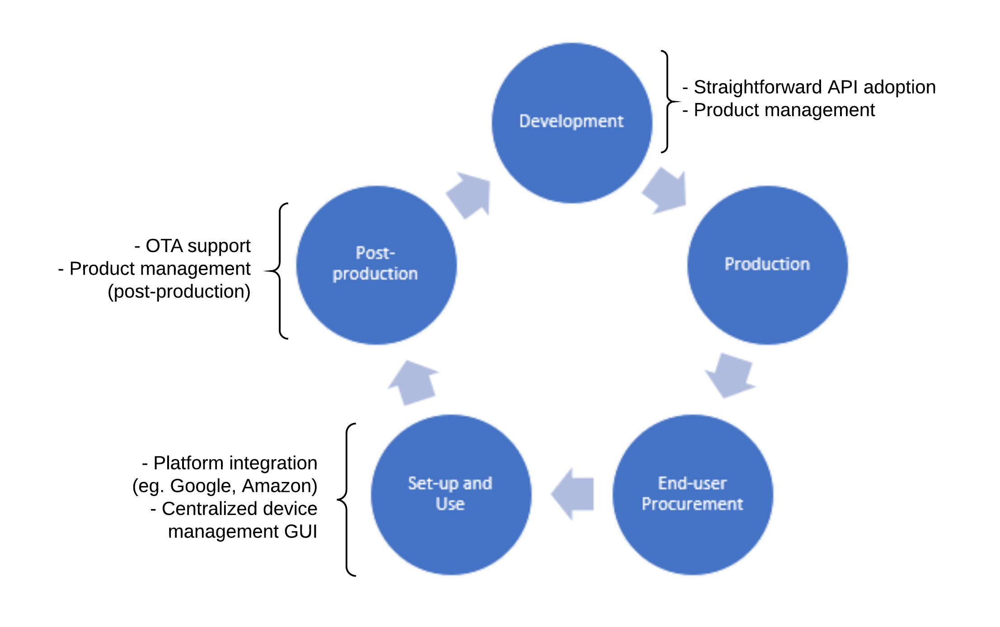

# What is BeeHive?
BeeHive is an IoT platform designed to deliver on-the-cloud solutions for IoT applications. It offers a unified API built on robust up-to-date technologies and techniques, targeted to all kinds of end-users looking to implement IoT and makers looking to market their products to end-users.

# The Universal IoT Platform

The ultimate goal of BeeHive is to become the universal IoT platform for all IoT applications by:

1. Offering a robust and easy-to-implement API
2. Offering comprehensive services for use in IoT applications
3. Ensuring secure encrypted communication
4. Being hosted completely on-the-cloud

## For the End-User

Save time and resources in setting up your own IoT platform with endless configurations and development. BeeHive offers ready-made services* built specifically to run out-of-the-box:

1. Thing Management Platform
2. Automation Engine
3. Data Collection and Analytics
4. Ready-to-use MQTT broker
5. Web Application GUI for Thing Management

All services run on-the-cloud, eliminating the need for local infrastructure. BeeHive's unified API focuses on simplicity and intuitiveness for easy end-user adoption and use of the listed services.

*\*services listed are not final, more may be added in the future*

## For the Maker

BeeHive aims to simplify the development process for makers by offering maker-centered services* targeted on development, set-up and use, and post-production stages of a device's lifecycle:

BeeHive allows for makers to quickly develop devices on a unified easy-to-use API for a wide range of applications—from smarthomes to smart cities. For makers looking for a wider customer reach, BeeHive also offers platform integration** with other IoT ecosystems (eg. Google, Amazon) without the hassle of adopting the individual APIs.

BeeHive also offers post-production support by hosting OTA updates, allowing makers to eliminate dedicated infrastructure and host their aftermarket support completely on BeeHive.

*\*services listed are not final, more may be added in the future*

*\*\*not yet available, still under development*

# I Would Like to Know More...

We have made a primer and a high-level documentation that discusses BeeHive in greater detail:

* [BeeHive Primer](https://mirascarlo934.github.io/BeeHiveDocu/primer)
* [High-Level Documentation](https://mirascarlo934.github.io/BeeHiveDocu/high-level-documentation)

# Is There a Demo?

Yes! BeeHive already exists as a proof-of-concept and can be accessed over the internet. Check out the following documentation for the API:

*Please read the following documentation first before using BeeHive.*

- ***\*\*READ FIRST\*\**** [High-Level Documentation](https://mirascarlo934.github.io/BeeHiveDocu/high-level-documentation)
- [Thing Management Platform](https://documenter.getpostman.com/view/11218501/SztEY6Ao) (Postman Documenter)
- [Product Management Platform](https://documenter.getpostman.com/view/11218501/T1DngxJv) (Postman Documenter)
- [Automation Engine](https://documenter.getpostman.com/view/11218501/SztEY6hi) (Postman Documenter)
- [Data Collection and Analytics](https://documenter.getpostman.com/view/11218501/SztEY6hj) (Postman Documenter)
- [MQTT API]()
- [GUI]()

**BeeHive URL:** http://35.241.123.200

# We Need Your Help!

**At its current state, BeeHive only offers the very basic services it aims to deliver. With support and funding, BeeHive can be spun into a startup and expand its services to reach its goal and become the universal IoT platform.**

## Contact Us

If you have questions or you're willing to help us however you can, feel free to contact us at:

contactus.beehive@gmail.com

