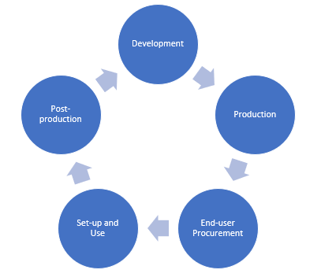
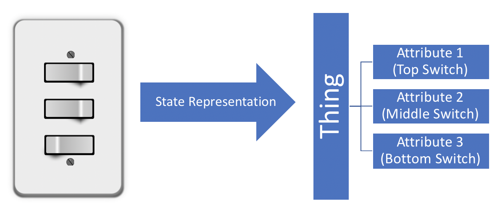

# What is this Document?

This document highlights the services and key concepts of BeeHive from a **maker** perspective, giving a high-level insight on how to develop devices for the BeeHive IoT universe. 

# Device Lifecycle

IoT devices typically follow the following lifecycle:

1. Development
2. Production
3. End-user Procurement
4. Set-up and Use
5. Post-production

This lifecycle concerns three entities: the **maker**, the **end-user**, and **BeeHive**. The table below describes the areas of concern for each entity:

| Lifecycle Phases     | maker     | end-user  | BeeHive   |
| -------------------- | --------- | --------- | --------- |
| Development          | ***YES*** | no        | ***YES*** |
| Production           | ***YES*** | no        | no        |
| End-user Procurement | ***YES*** | ***YES*** | no        |
| Set-up and Use       | no        | ***YES*** | ***YES*** |
| Post-production      | ***YES*** | no        | ***YES*** |

BeeHive concerns itself in three phases: **development**, **set-up and use**, and **post-production**.

# Services

Currently, BeeHive exists as a proof-of-concept and offers 6 basic services:

- Thing Management Platform
- Product Management Platform
- Automation Engine
- Data Collection and Analytics
- MQTT API
- GUI

This section discusses services only on a high-level perspective. For more details, specifically on how-to-use, refer to the API documentation of each service.

### Proof-of-Concept

Since BeeHive is just in a proof-of-concept stage, there are many limitations:

1. Authentication — There currently exists no maker and end-user authentication. Makers and end-users are distinguished from each other solely on their maker ID and user ID. Before trying out  services, makers and end-users are expected to generate their own ID (preferably UUID) for use in BeeHive's services.
2. Security — All data sent to and from BeeHive are transported in plaintext. Sensitive information ***must not*** be involved when trying out BeeHive.
3. System Availability — The POC runs only on one server without any runtime contingency measures. As such, the system ***may*** crash due to various things such as high traffic and resource-intensive processes (ie. Automation Engine rule evaluation). We will try to keep runtime at a maximum. If problems occur, contact us at [contactus.beehive@gmail.com](contactus.beehive@gmail.com).

*The POC exists for potential makers and end-users for the sole purpose of trying out the services that BeeHive intends to offer. The current state of these services are not final and more services may be added in the future.* 

## Thing Management Platform

The Thing Management Platform is the heart of BeeHive which manages the registration, management, and control of devices in the BeeHive IoT universe. These devices are referred to as *Things* and will be referred to as such throughout this documentation.

This service is an **end-user service** for the **set-up and use** phase of a device lifecycle. End-users interact directly with this service for Thing management and control.

The detailed API documentation can be found [here](https://documenter.getpostman.com/view/11218501/SztEY6Ao).

### Things

BeeHive sees Things as unique entities that have discrete functionalities called *Attributes*.

Conceptually, a Thing can be imagined as a container for tightly-coupled functionalities. With the example above, the wallswitch is fully represented by three attributes which have a "switching" functionality (ie. can be 1 or 0), all of which belong to the same *Thing* which is the wallswitch. 

Device makers must adhere to this Thing model for the devices to fully utilize BeeHive's API. 

### Attributes

An Attribute is the most basic unit of functionality of a Thing. There are 4 attribute types:

- binary (1 or 0)
- number (64-bit integer or double)
- enumeration (user-defined enum values)
- string

BeeHive views attributes as a direct interface between a Thing and its real-world functionality/ies. BeeHive manipulates attributes as its way of manipulating the functionality/ies of the Thing that contains them.

### Groups

Groups are a virtual entity which allows for organization of Things based on functionality and/or user preference. Things can be grouped into one or multiple groups and groups can be grouped into other groups.

Beyond simple organization, groups can also be used to collate data from contained Things. See [Automation Engine API](https://documenter.getpostman.com/view/11218501/SztEY6hi) and [Data Collection and Analytics API](https://documenter.getpostman.com/view/11218501/SztEY6hj) for more information on this functionality.

## Product Management Platform

The Product Management Platform caters specifically to makers that look to mass-produce their Things for the public. This service offers the ability for makers to create and manage *Products* and other maker-related tools such as OTA firmware updating.

This service is a **maker service** for the **development** and **post-production** phases of a device lifecycle.

The detailed API documentation can be found [here](https://documenter.getpostman.com/view/11218501/T1DngxJv).

### Products

A Product can be imagined as an archetype for Things. It outlines Attributes which a Thing will contain upon registration to the BeeHive IoT universe.

When an end-user procures a Thing from the maker, they will need to register it to BeeHive to use it. Traditionally, the Thing can register its Attributes itself. But this results to an after-market limitation in which the Thing's Attributes can no longer be updated once it leaves the production line. Instead of this, a Thing can register its Product instead, which the maker can manage via the Product Management Platform. This allows for makers to manage their Things' functionalities even after production.

### OTA

Makers can also update the firmware of their Things post-production via the OTA service of the Product Management Platform. The firmware is delivered via HTTP which the Thing needs to request from the BeeHive server, the URL of which is defined in the Product of the Thing.

## Automation Engine

The Automation Engine is a *rule engine* designed to automate workflows consisting of different Things working together. This service holds a collection of *Rules* which control Things based on predefined conditions.

This service is an **end-user service** for the **set-up and use** phase of a device lifecycle.

The detailed API documentation can be found [here](https://documenter.getpostman.com/view/11218501/SztEY6hi).

### Rules

A Rule is an ***end-user-defined***, ***event-triggered***, ***condition-action*** workflow that works on the current state of Things, specifically their attributes.

A rule consists of two parts: the **condition** and **action**. The end-user sets the condition and, if met, the rule executes the action. Both parts consist of attributes which the Rule works on. A rule is evaluated every time a *condition attribute* changes value. If the entire condition is met, the *action attribute/s* then changes value based on what the user defined.

The simple rule UML below consists of one *condition attribute*: Thing A attribute 1; and one *action attribute*: Thing B attribute 2.

Rules are written in MVEL.

## Data Collection and Analytics

The detailed API documentation can be found [here](https://documenter.getpostman.com/view/11218501/SztEY6hj).

## MQTT API

## GUI